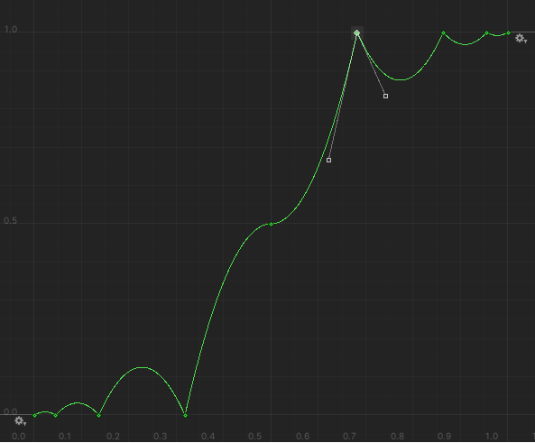
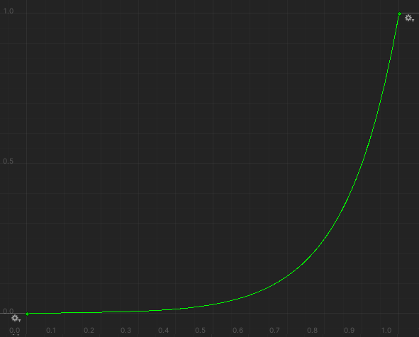
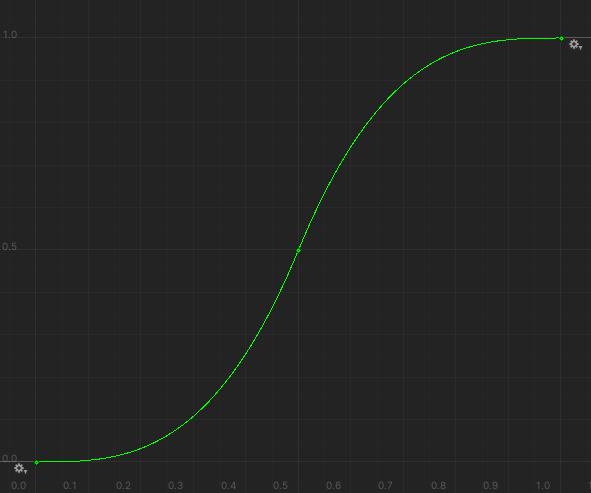
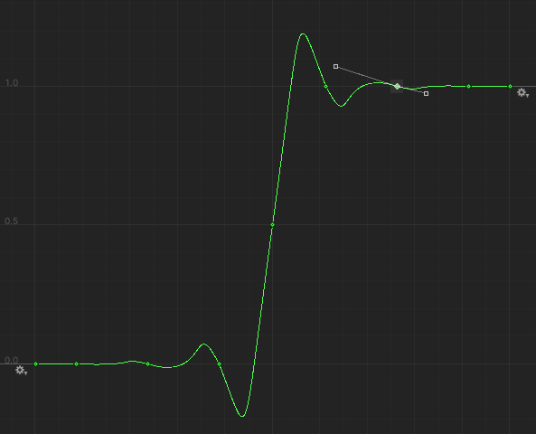
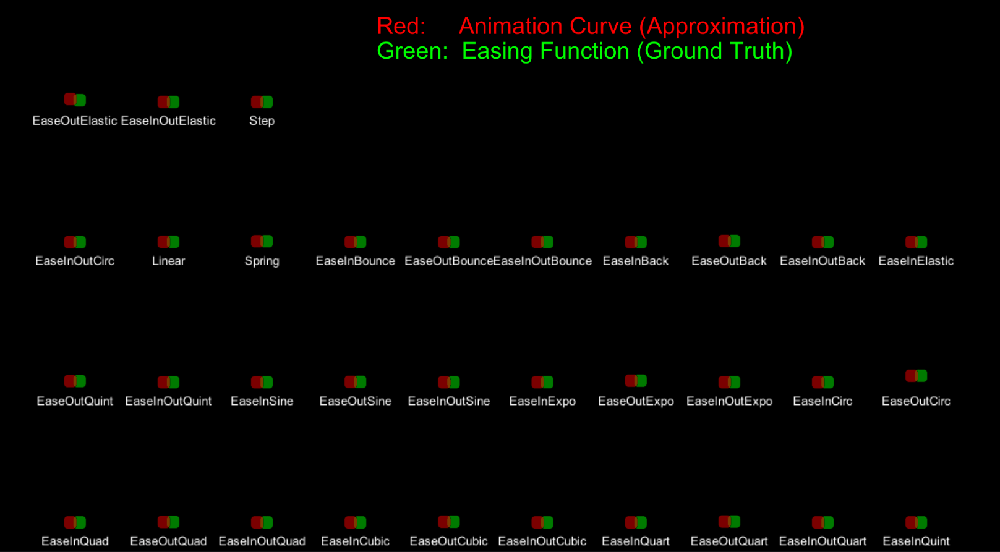
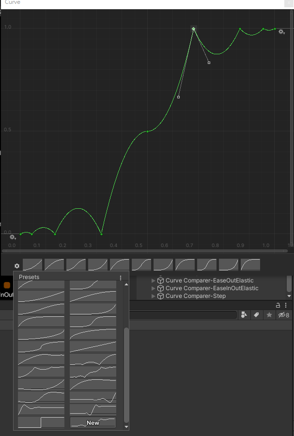

# Unity-EasingAnimationCurve
EasingAnimationCurve is a simple and fast solution of converting Easing functions to UnityEngine.AnimationCurve.

It used fewer keyframes to approximate the easing functions rather than sampling points averagely as keyframes. 

There are only 2 ~ 9 keyframes in a curve.

* You can download the [curve presets](#animationcurve-presets) if you only need the AnimationCurve resources.
* Main features are all in `EasingAnimationCurve.cs`, and `EasingAnimationCurveExample.cs` shows all usages of this repo.

## Preview

| EaseInOutBounce: 9 keyframes  | EaseInExpo: 2 keyframes  |
|---|---|
|   |   |

| EaseInOutCubic: 3 keyframes  | EaseInOutElastic: 9 keyframes  |
|---|---|
|   |   |

Show all comparaison of easing function(GREEN) and animation curve(RED):

## AnimationCurve Presets
You can put the presets into your project without any scripts. See [EasingFunctionPresets.unitypackage](https://github.com/qwe321qwe321qwe321/Unity-EasingAnimationCurve/releases/tag/1.0.0).

## EaseElastic has an obvious error
Only Elastic series have larger errors with the original easing function. But it still works as elastic function with different spring arguments. So it works for me.

If you feel the error is too large, you can make precise points via `CubicBezierFitter` and replace the original bezier points in `EasingAnimationCurve`. You can open Example scene and get the usage of them from `EasingAnimationCurveExample.cs`.

## Implementation

### 1. Easing Function -> Cubic Bezier
I used the data in this paper [Easing Functions in the New Form Based on Bézier Curves by Dariusz Sawicki 2016](https://www.researchgate.net/publication/308007569_Easing_Functions_in_the_New_Form_Based_on_Bezier_Curves) to convert them into cubic bezier.

And I found this thread with a solution to fitting cubic bezier by data points. 
> https://stackoverflow.com/questions/5525665/smoothing-a-hand-drawn-curve

It's very helpful to make other types of curve to Bezier curve by fitting.
See [`CubicBezierFitter.cs`](https://github.com/qwe321qwe321qwe321/Unity-EasingAnimationCurve/blob/main/Assets/Runtime/CubicBezierFitter.cs)

### 2. Cubic Bezier -> Animation Curve
See `EasingAnimationCurve.cs`: [here](https://github.com/qwe321qwe321qwe321/Unity-EasingAnimationCurve/blob/main/Assets/Runtime/EasingAnimationCurve.cs#L480)

There are some helpful references:
* https://answers.unity.com/questions/623318/how-to-convert-cubic-bezier-curve-into-animationcu.html
* https://answers.unity.com/questions/464782/t-is-the-math-behind-animationcurveevaluate.html?_ga=2.199800430.1917493740.1605667091-254103663.1587534286
* https://answers.unity.com/questions/7682/how-can-i-set-the-tangents-of-keyframes-in-an-anim.html
* https://docs.unity3d.com/ScriptReference/Keyframe.html

## Environment
Unity 2019.4.12f1 LTS
